# [항해 플러스] 2주차 과제 클린아키텍처 - 특강 신청 서비스

## Description

- `특강 신청 서비스`를 구현해 봅니다.
- 항해 플러스 토요일 특강을 신청할 수 있는 서비스를 개발합니다.
- 특강 신청 및 신청자 목록 관리를 RDBMS를 이용해 관리할 방법을 고민합니다.

## Requirements

- 아래 2가지 API 를 구현합니다.
    - 특강 신청 API
    - 특강 신청 여부 조회 API
- 각 기능 및 제약 사항에 대해 단위 테스트를 반드시 하나 이상 작성하도록 합니다.
- 다수의 인스턴스로 어플리케이션이 동작하더라도 기능에 문제가 없도록 작성하도록 합니다.
- 동시성 이슈를 고려하여 구현합니다.

## API Specs

1️⃣**(핵심)** 특강 신청 **API `POST /lectures/apply`**

- [x] 특정 userId 로 선착순으로 제공되는 특강을 신청하는 API 를 작성합니다.
- [x] 동일한 신청자는 한 번의 수강 신청만 성공할 수 있습니다.
- [x] 각 강의는 선착순 30명만 신청 가능합니다.
- [x] 이미 신청자가 30명이 초과되면 이후 신청자는 요청을 실패합니다.
- [x] 어떤 유저가 특강을 신청했는지 히스토리를 저장해야한다.

2️⃣**(기본)** 특강 목록 API **`GET /lectures`**

- [x] 단 한번의 특강을 위한 것이 아닌 날짜별로 특강이 존재할 수 있는 범용적인 서비스로 변화시켜 봅니다.
    - 이를 수용하기 위해, 특강 엔티티의 경우 기본 과제 SPEC 을 만족하는 설계에서 변경되어야 할 수 있습니다.
- [x] 특강의 정원은 30명으로 고정이며, 사용자는 각 특강에 신청하기전 목록을 조회해볼 수 있어야 합니다.

3️⃣**(기본)** 특강 신청 완료 여부 조회 API **`GET /lectures/application/{userId}`**

- [x] 특정 userId 로 특강 신청 완료 여부를 조회하는 API 를 작성합니다.
- [x] 특강 신청에 성공한 사용자는 성공했음을, 특강 등록자 명단에 없는 사용자는 실패했음을 반환합니다. (true, false)

<aside>
💡 KEY POINT
</aside>

- 정확하게 30명의 사용자에게만 특강을 제공할 방법을 고민해 봅니다.
- 같은 사용자에게 여러 번의 특강 슬롯이 제공되지 않도록 제한할 방법을 고민해 봅니다.

# 주요 기술 선정 이유

- 비관적 락(Pessimistic Lock)을 선택한 이유는 트랜잭션 충돌이 발생할 가능성을 미리 예상하고, 데이터의 무결성과 일관성을 보장하기 위해서입니다.  
  비관적 락은 요청이 들어오면 먼저 락을 걸어 다른 트랜잭션의 접근을 차단하고 처리합니다.  
  선착순으로 특강을 신청할 때 가장 먼저 온 요청이 정상적으로 처리되고, 이후의 요청들은 이전 요청이 완료될 때까지 기다렸다가 순차적으로 진행되도록 보장합니다.  
  이런 처리 방식으로 동시에 다수의 사용자가 접근하더라도 안정적으로 요청을 처리 할 수 있습니다.

- 격리된 테스트를 위해 `@Sql`을 사용하여 DB의 데이터를 초기화 하도록 했습니다.  
  공유 자원을 사용하는 테스트는 실행 순서에 따라 성공, 실패 여부가 달라지는 비결정적 테스트가 될 수 있기 때문에 각 테스트를 격리 하여 순서와 상관없이 테스트가 실행되도록 했습니다.

# 아키텍처

Clean + Layered Architecture

```
├─common
│  ├─config
│  │      JpaConfig.java
│  │      
│  ├─exception
│  │      BaseException.java
│  │      ExceptionInterface.java
│  │      
│  └─handler
│          ApiControllerAdvice.java
│          ErrorResponse.java
│
├─controller
│  │  LectureController.java
│  │
│  └─dto
│          ApplyLectureResDto.java
│          FindLectureResDto.java
│          FindLectureScheduleResDto.java
│
├─domain
│  └─lecture
│      │  Lecture.java
│      │  LectureHistory.java
│      │  LectureSchedule.java
│      │
│      ├─exception
│      │      AlreadyExistException.java
│      │      LectureCapacityException.java
│      │      LectureDateException.java
│      │      LectureExceptionEnums.java
│      │
│      ├─repository
│      │      LectureHistoryRepository.java
│      │      LectureRepository.java
│      │      LectureScheduleRepository.java
│      │
│      └─service
│              ApplyLectureValidator.java
│              LectureService.java
│              LectureServiceImpl.java
│              LectureValidator.java
│
└─infra
    │  LectureHistoryJpaRepository.java
    │  LectureHistoryRepositoryImpl.java
    │  LectureJpaRepository.java
    │  LectureRepositoryImpl.java
    │  LectureScheduleJpaRepository.java
    │  LectureScheduleRepositoryImpl.java
    │
    ├─entity
    │      BaseCreateDatetimeEntity.java
    │      BaseEntity.java
    │      LectureEntity.java
    │      LectureHistoryEntity.java
    │      LectureScheduleEntity.java
    │
    └─mapper
            LectureHistoryMapper.java
            LectureMapper.java
            LectureScheduleMapper.java


```

# ERD

```mermaid
erDiagram
    lecture ||--|{ lecture_schedule: contains
    lecture_schedule ||--o{ lecture_history: contains
    lecture {
        long id PK "특강 PK"
        string lecture_name "특강 명"
        datetime create_datetime "생성일"
        datetime modify_datetime "수정일"
    }
    lecture_schedule {
        long id PK "특강 스케쥴 PK"
        long lecture_id "특강 PK"
        datetime lecture_datetime "특강 시작일"
        int register_cnt "신청 인원"
        int capacity "정원"
        datetime create_datetime "생성일"
        datetime modify_datetime "수정일"
    }
    lecture_history {
        long id PK "특강 신청 내역 PK"
        long lecture_schedule_id UK "특강 PK"
        long user_id UK "유저 PK"
        datetime create_datetime "생성일"
    }
```


